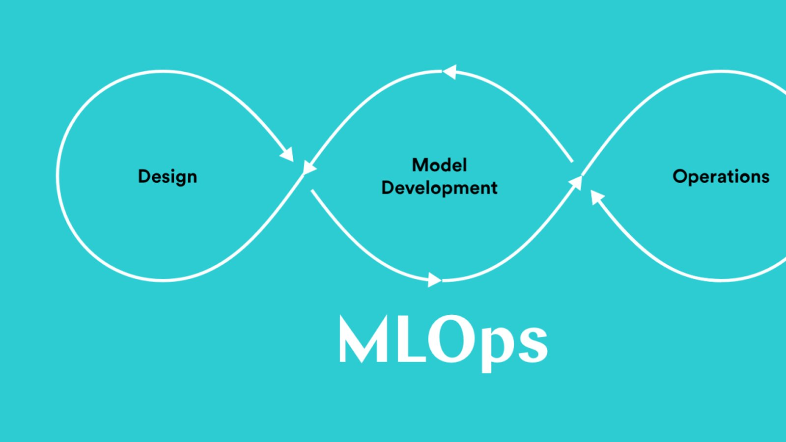

# End-to-End MLOps Tutorial

Welcome to the **End-to-End MLOps Tutorial**! This tutorial covers everything you need to get started with MLOps. Throughout this guide, we’ll dive deep into each topic with practical examples to help you build, deploy, and manage machine learning models effectively.

CI_Intro: https://github.com/iamprashantjain/CI_Intro

### Connect with Me:
Feel free to connect with me on [LinkedIn](https://www.linkedin.com/in/iamprashantjain/) for updates and further discussion.

Let’s get started on your MLOps journey!